## About
Last Updated March 1, 2019
Created by Tara Carlisle

## Table of Contents
* [Navigating dashboard and functions](#1-Navigating-the-WP-dashboard-and-functions) 
* [WordPress Themes](#2-WordPress-Themes) 
* [Adding Pages](#3-Adding-Pages) 
* [Add a Feature Image](#4-Add-a-Feature-Image)
* [Adding Blocks](#5-Adding-Blocks) 

## Introduction
WordPress is a great tool for creating a blog or website especially for those who don’t want to do much html coding. WordPress allows you to choose a template or “theme” for your website that provides the structure and format for your website. 

But before diving into WordPress, it is important to consider what you want your website to communicate, always keep your audience in mind. 

Think about the story that you want to tell with the text, images, and other media you have gathered through your research. Sometimes it helps to first draw out a sketch to get an idea of how to organize the content, especially if you are working in a group. 

Remember to keep it simple! You can always add more later. 

Once you have a plan sketched out, you are ready to create the website.

## Getting Started

### 1. Navigating the WP dashboard and functions
After logging in with your username and password you are on the main administration screen called the Dashboard. The navigation on the left lists all of the basic functions to build a web page. For this lesson we will focus on adding pages and media such as images and videos. 

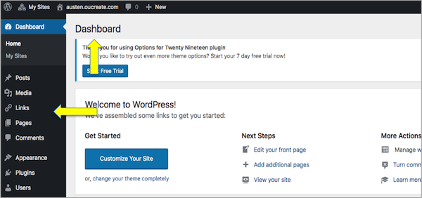

### 2. WordPress Themes
WordPress allows you to choose a template or “theme” for your website that provides the structure and format for your website. The default template is "Twenty Nineteen."*

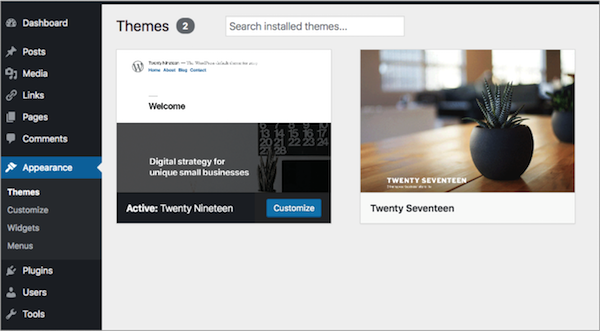

### 3. Adding Pages
Located in the left-hand navigation you'll see *Pages* and *Posts* listed. What is the difference? A website is composed of pages and a blog is composed of posts. For this project, you'll be creating a website so will only need to add pages.   

**Add a new page:** 

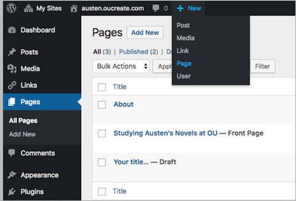

Save your work by clicking on publishing. Yes, it's not intuitive, but remember PUBLISH = SAVE. WordPress will automatically save your work and it is possible to restore previous versions, but it is good practice to save (publish) any changes.

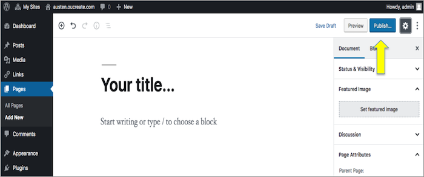

Once you've added a page, click on *Pages* in the left-hand navigation to view all of your pages. 

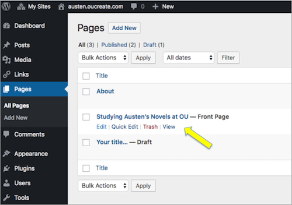

### 4. Add a Feature Image 
To add a large feature images at the top of a page, click on *Set featured image* located on the pages right navigation. 

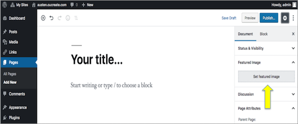

### 5. Adding Blocks (text, images, videos, etc)
WordPress has started incorporating *blocks* for building a website. When clicking on the + sign, you'll see there are lots of choices of different kinds of blocks of content to add, such an image, text, groups of images, or a combination of text and image. 

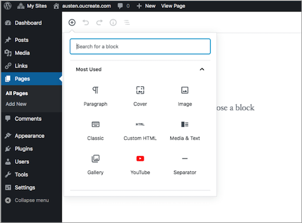

To add an image, either drag the file from your desktop into the media box or click on *Upload* to access the files you want to upload. 

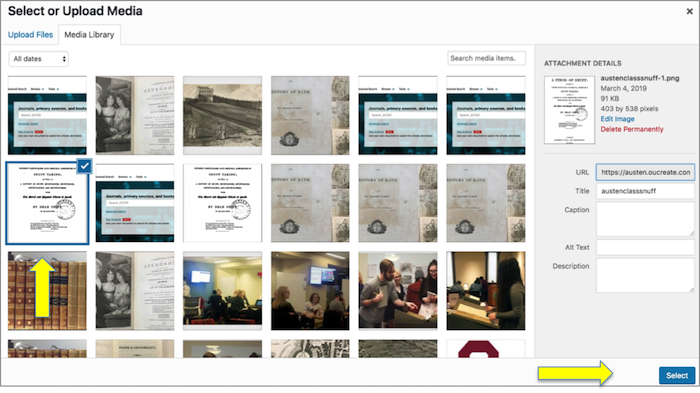

It is possible to adjust an image's size through *Image Settings* located on the right. 

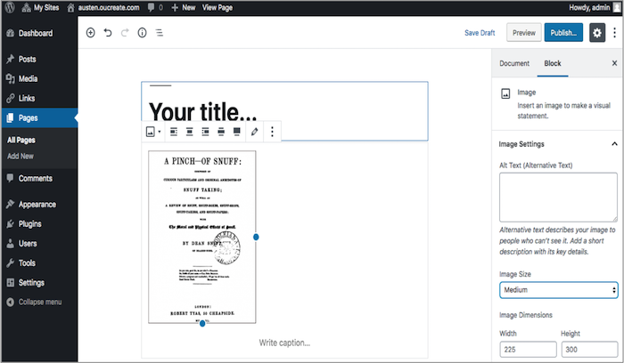

**Add some text**

Like images, you can add a *block* of text to a page. There are two kinds of text blocks: Paragraph or Classic. Classic allows a little more control of how the text is displayed. 

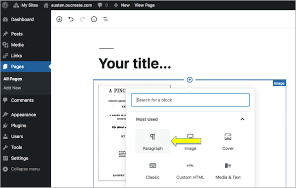

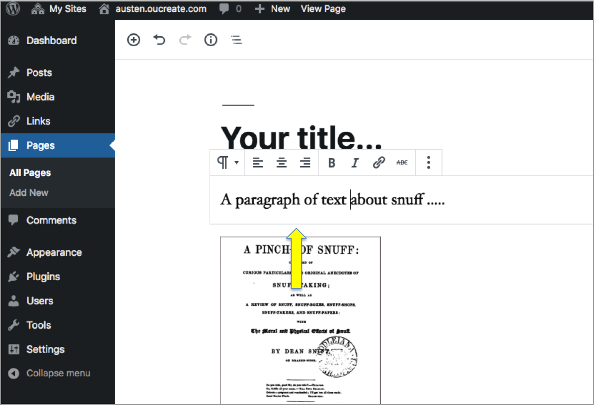

### 6. File Management tips 

Here are a few tips to keep in mind: 

* Images should be no larger than 1200 pixels wide.
* Gather images for the website in a separate folder on a desktop to make the process of uploading images easier.
* Once images have been uploaded to the WP Media Library, it is possible to adjust the size to large, medium or small.
* Considering writing and editing text in a separate document and then just paste the text in the paragraph blocks.

check
[Return to Top](#about)
