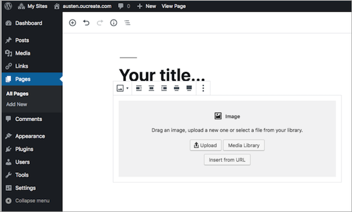

## About
Last Updated March 1, 2019
Created by Tara Carlisle

## Table of Contents
* [Navigating dashboard and functions](#navigating-the-wp-dashboard-and-functions) 
* [WordPress Themes](#wordpress-themes) 
* [Adding Pages](#adding-pages) 
* [Add a Feature Image](#add-a-feature-image)
* [Adding Blocks](#adding-blocks) 

## Introduction
WordPress is a great tool for creating a blog or website, especially for those who do not want to do much html coding. It allows you to choose a template or “theme” for your website that provides the format for your website. 

But before diving into WordPress, it is important to consider what you want your website to communicate, always keep your audience in mind. 

Think about the story that you want to tell with text, images, and other media you have gathered through your research. Sometimes it helps to first draw a sketch to visualize and organize the content of the story, especially if you are working in a group. 

Remember to keep it simple! You can always add more later. 

Once you have a plan sketched out, you are ready to create the website.

## Getting Started

### Navigating the WP dashboard and functions
After logging in with your username and password you'll see the main administration screen called the Dashboard. The navigation on the left lists all of the basic functions to build a web page. For this lesson we will focus on adding pages that will include your writings and any images or video to enrich the site. 

### WordPress Themes
WordPress allows you to choose a template or “theme” for your website that provides the structure and format of your website. The template for this lesson is *Twenty Nineteen*.

### Adding Pages
Located in the left-hand navigation you'll see *Pages* and *Posts* listed. What is the difference? A website is composed of pages and a blog is composed of posts. For this project, you'll be creating a website so you will only need to add pages.   

**Add a new page:** 

To save your work click *Publish*. Yes, it's not intuitive, but remember PUBLISH = SAVE. WordPress will automatically save your work and while it is possible to restore previous in WordPress, it is good practice to save (publish) any changes.

Once you've added a page, click on *Pages* in the left-hand navigation to view all of your pages. 

### Add a Feature Image 
To add a large, featured image at the top of a page, click on *Set featured image* located on the page's right navigation. 

### Adding Blocks (text, images, videos, etc)
WordPress has started incorporating *blocks* for building a website. When clicking on the + sign, you'll see there are several types of blocks from which to choose, such as an image, text, group of images, or a combination of text and image. For now, let's choose image.

To add an image to the block, either drag the file from your desktop into the media box or click on *Upload* to access the files you want to upload. 

It is possible to adjust an image's size through *Image Settings* located on the right. 

**Add some text**

Similarly, you can add a *block* of text to a page. There are two kinds of text blocks: *Paragraph* or *Classic*. Classic allows a little more control of how the text is displayed. 

### File management and other things

Here are a few tips to keep in mind: 

* Consider designating roles for your group. Do you have a good writer, someone who likes to edit images, a web designer in your group? Identify each of your strengths and then perhaps asign roles within the group. 
* Images should be no larger than 1200 pixels wide.
* Gather images for the website in a separate folder on a desktop to make the process of uploading images easier.
* Once images have been uploaded to the WP Media Library, it is possible to adjust the size to large, medium or small.
* Consider writing and editing text in a separate document and then paste it into the website's text blocks. Having the text written and organized before adding it to the website may help avoid mistakes or inconsistencies. 

check
[Return to Top](#about)
